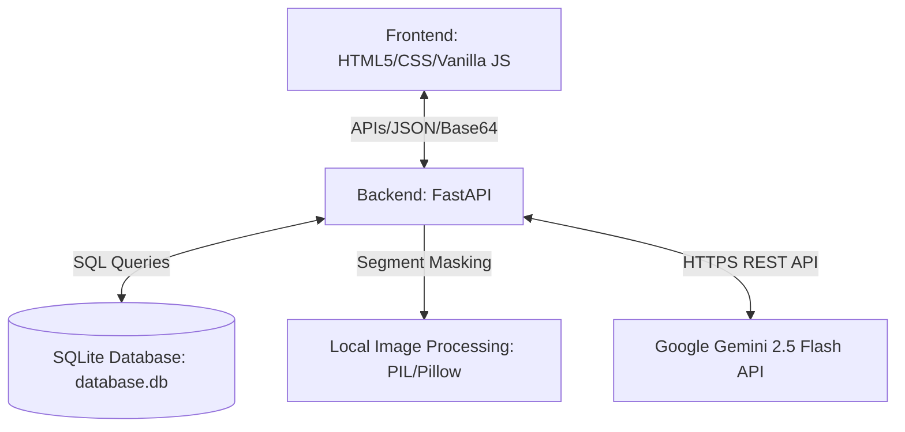
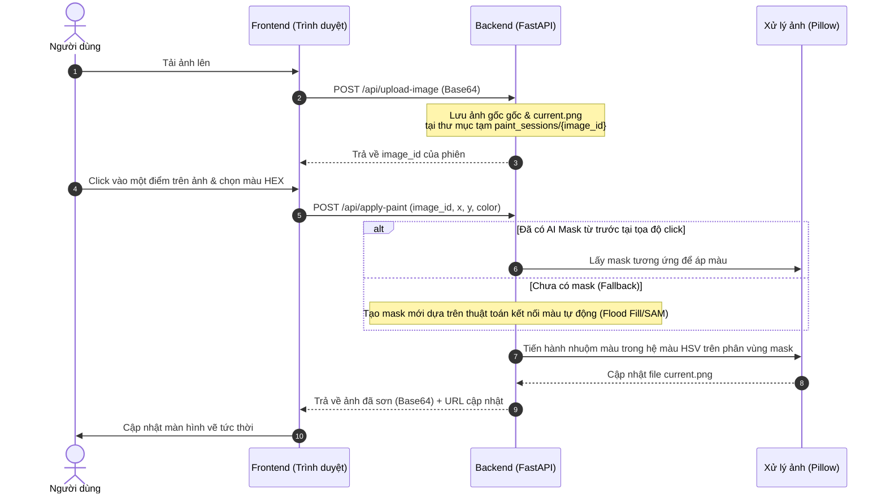

# 🧭 Tài Liệu Workflow Hoạt Động Hệ Thống PaintAI

PaintAI là hệ thống phối màu kiến trúc thông minh kết hợp giữa **Frontend (Single Page Application)**, **Backend (FastAPI)**, và **Google Gemini 2.5 Flash API**. Hệ thống cung cấp hai luồng hoạt động chính: phối màu tự động bằng trí tuệ nhân tạo (AI-Colorize) và phối màu thủ công bằng tương tác click (Click-to-Paint).

---

## 🏗️ 1. Kiến Trúc Tổng Quan Hệ Thống

Hệ thống hoạt động theo mô hình Client-Server khép kín:



*   **Frontend (Static Web App)**: Xây dựng bằng HTML5, CSS3 (Tailwind CSS) và Vanilla JavaScript. Sử dụng **HTML5 Canvas** để xử lý hiển thị ảnh, so sánh trước/sau (comparison slider), vẽ vùng phát hiện và thực hiện tương tác kéo thả.
*   **Backend (FastAPI)**: Đóng vai trò là trung tâm điều phối, quản lý phiên làm việc (`paint_sessions`), lưu trữ dữ liệu vào SQLite, gọi API ngoài (Gemini) và trực tiếp xử lý xử lý ảnh cục bộ qua thư viện **Pillow (PIL)** và **NumPy**.
*   **Database (SQLite)**: Lưu trữ danh mục loại công trình, nhãn hiệu sơn, thư viện ảnh mẫu (`collections` & `layers`), bảng màu sơn chuẩn (`paint_colors`) và các phương án thiết kế được người dùng lưu lại.

---

## 🔄 2. Chi Tiết Luồng Hoạt Động Chính (AI Colorize Flow)

Đây là workflow quan trọng nhất, giúp tự động nhận diện vùng kiến trúc có thể sơn và gợi ý màu sắc phù hợp.

```mermaid
sequenceDiagram
    autonumber
    actor User as Người dùng
    participant FE as Frontend (Trình duyệt)
    participant BE as Backend (FastAPI)
    participant Gemini as Gemini 2.5 API
    participant PIL as Xử lý ảnh (Pillow)
    database DB as SQLite

    User->>FE: Tải ảnh lên & chọn loại công trình (nội thất/ngoại thất)
    FE->>BE: POST /api/ai-colorize (Base64 Image + API Key)
    BE->>Gemini: Gửi ảnh + Prompt phân tích vùng sơn & phối màu
    alt Gemini phản hồi thành công (200 OK)
        Gemini-->>BE: Trả về JSON chứa các vùng detected_areas & gợi ý phối màu
        BE-->>FE: Trả về kết quả phân tích (success: true + dữ liệu vùng)
    else Gemini lỗi (Rate limit 429 / Quota 400 / Key sai)
        Gemini-->>BE: Lỗi HTTP
        BE-->>FE: Trả về error_type + message rõ ràng. DỪNG LUỒNG.
        FE->>User: Hiển thị thông báo lỗi API cụ thể
    end

    Note over FE, User: Người dùng xem các phân vùng & chọn màu sơn mong muốn

    User->>FE: Bấm "Tạo ảnh phối màu"
    FE->>BE: POST /api/ai/generate-colors (Ảnh gốc, paintAreas, detectedAreas)
    BE->>PIL: Chuyển dữ liệu qua module image_painter
    Note over PIL: Phủ màu theo bounding box/polygon,<br/>giữ nguyên texture gốc theo tỷ lệ 70:30
    PIL-->>BE: Trả về ảnh đã tô màu hoàn thiện
    BE-->>FE: Trả về ảnh kết quả dạng Base64
    FE->>User: Hiển thị ảnh phối màu dạng so sánh Before/After
    
    User->>FE: Bấm "Lưu thiết kế"
    FE->>BE: POST /api/saved-designs (Tên thiết kế, ID công trình, Bảng màu)
    BE->>DB: Ghi vào bảng saved_designs
    DB-->>BE: Xác nhận ghi thành công
    BE-->>FE: Trả về thông báo thành công
    FE->>User: Cập nhật danh sách "Thiết kế của tôi"
```

### Chi tiết các bước xử lý:

### 1️⃣ Phân tích & Nhận diện (Gemini API)
*   **Endpoint**: `POST /api/ai-colorize`
*   **Mô tả**: Frontend chuyển đổi ảnh người dùng tải lên thành chuỗi Base64 và gửi lên Backend. Backend sẽ đính kèm một **System Instruction** rất chặt chẽ, yêu cầu Gemini 2.5 Flash phân tích cấu trúc kiến trúc và trả về định dạng JSON thuần túy chứa:
    *   `detected_areas`: Danh sách các phân vùng sơn (tường chính, viền, cột, trần...) kèm theo tọa độ bounding box (`box_2d` dạng 0-1000) và polygon (`polygon_2d`) bao quanh bề mặt có thể sơn.
    *   `suggested_palettes`: Gợi ý các bảng màu phối hợp ăn ý.
*   **Chống lãng phí**: Nếu bước này bị lỗi (ví dụ: Key lỗi, hết hạn mức Quota), hệ thống trả về thông tin lỗi rõ ràng và **không gọi** tiếp bước xử lý ảnh sau đó.

### 2️⃣ Phối màu & Giữ vân bề mặt (Local PIL Processing)
*   **Endpoint**: `POST /api/ai/generate-colors`
*   **Mô tả**: Khi người dùng chọn màu và bấm áp dụng, Backend sử dụng dữ liệu `detectedAreas` mà Gemini đã phân tích ở bước 1 cùng với mã màu sơn thực tế mà người dùng chọn.
*   **Công thức phối màu giữ Texture**:
    Để ảnh trông chân thực và không bị bẹt màu, thuật toán trong `image_painter.py` hòa trộn màu sơn mới với màu gốc theo tỷ lệ thông minh:
    $$\text{Pixel mới} = \text{Pixel gốc} \times (1 - \text{blend\_ratio}) + \text{Màu sơn mới} \times \text{blend\_ratio}$$
    *   *Tường chính (Primary paint)*: 70% màu mới, 30% vân bề mặt gốc.
    *   *Mảng nhấn (Accent paint)*: 65% màu mới, 35% vân bề mặt gốc.
    Nhờ đó, toàn bộ đổ bóng (shadows), độ nhám của vật liệu tường, và ánh sáng mặt trời nguyên bản đều được giữ nguyên.

---

## 🖱️ 3. Luồng Hoạt Động Tương Tác Thủ Công (Click-to-Paint Flow)

Ngoài chế độ tự động phân tích bằng AI, người dùng có thể nhấp chuột trực tiếp vào từng khu vực trên màn hình để thay đổi màu sắc của khu vực đó.



*   **Quản lý phiên (Session-based)**: Mỗi bức ảnh khi upload sẽ tạo ra một thư mục tạm duy nhất trong `paint_sessions/{image_id}/` chứa `original.png`, `current.png`, và danh sách các mask vùng (`masks/mask_001.png`, `masks/mask_002.png`...).
*   **Mặt nạ vùng (Segmentation Masks)**: Được sinh ra từ việc phân tách dựa trên sự đồng nhất màu sắc (Flood fill) hoặc từ mô hình SAM (Segment Anything) nếu được cấu hình sẵn. Khi người dùng click vào tọa độ $(x, y)$, hệ thống sẽ lọc mask chứa điểm đó để nhuộm màu (sử dụng hệ màu HSV để bảo toàn độ sáng/độ tương phản).

---

## 🎨 4. Chiến Lược Phân Vùng Ngoại Thất & Nội Thất
Để ngăn chặn tình trạng tô màu lem ra bầu trời, cỏ cây hay sàn nhà, hệ thống định nghĩa các vùng bảo vệ mặc định khi xử lý ảnh công trình:

| Loại công trình | Phân chia vùng chiều cao | Trạng thái áp màu |
| :--- | :--- | :--- |
| **Ngoại thất (Exterior)** | **Top 25%**: Bầu trời (Sky)<br>**Mid 65%**: Tường nhà (Walls)<br>**Bot 10%**: Mặt đất/Cây cối (Ground) | 🔒 Giữ nguyên sky và ground<br>✨ Tô màu sơn vào khu vực Walls |
| **Nội thất (Interior)** | **Top 15%**: Trần nhà (Ceiling)<br>**Mid 60%**: Diện tường (Walls)<br>**Bot 25%**: Sàn nhà (Floor) | 🔒 Giữ nguyên sàn nhà<br>✨ Tô màu sơn vào Walls và Ceiling |

---

## 📂 5. Dữ Liệu Bảng Màu & Thư Viện Mẫu
1.  **Thư viện mẫu nhà sẵn có (`/api/collections`)**: Cho phép người dùng duyệt nhanh 100+ thiết kế mẫu được phân loại theo số tầng, số mặt tiền để phối thử màu mà không cần upload ảnh riêng.
2.  **Hệ thống Bảng màu Sơn (`/api/colors`)**: Truy xuất dữ liệu từ danh mục hơn 500 màu sơn chuẩn được đồng bộ từ các hãng nổi tiếng (Dulux, Jotun, Nippon, Tikkurila...), phân loại theo tông màu (Hiện đại, Cổ điển, Ấm áp, Tối giản...) giúp xuất báo cáo phối màu chuẩn xác cho thợ thi công.
